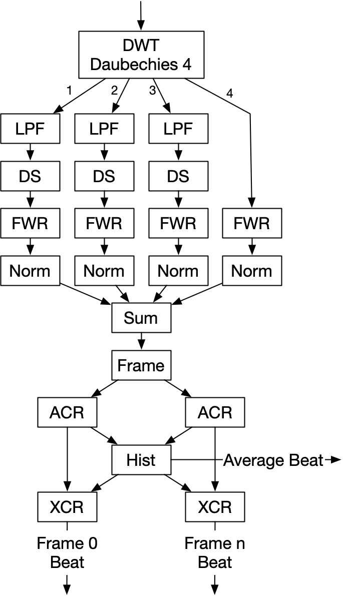

# beattrack - Track the rhythm of music in a wav file.

`Beattrack` is a command-line application that tracks the rhythm of music. The primary application is to play video frame-by-frame to the rhythm of the sound track. 

`beattrack` is ignorant of musical structure. I simply detects and tracks the rhythm of sound energy produced by the music. In the rest of this description *beat* will refer to the rhythm detected by `beattrack`. This rhythm will be the fastest rhythm in the music and the real **beat** will typically be a factor of this rhythm, for example: half or one quarter of the "beat" reported by `beattrack`. 

`beattrack` processes the sound track in a sequence of consecutive 2 second frames. For every frame it writes a frame record (see **Output** below) containing:

1. The frame number. The first frame has number 0.
2. The frame offset in the demultiplexed stream of samples. 
3. The offset of the first beat in the frame.
4. The number of samples between beats in the frame.

In addition to the frame records `beattrack` also reports the sample rate in Hz of the wav file as well as the average beats per second for the whole file.

## Running `beattrack`
Run `beattrack -h` for help.

## Input
The input is a wav file.

## Output
`beattrack` produces a JSON file containing the following data structure:

```
type OutRecord struct {
	FileName           string  // Input file
	SampleRate         int     // Hz
	AverageBeatsPerSec float64 // Average of the whole file
	FrameRecords       []*OutFrameRecord
}

type OutFrameRecord struct {
	FrameNo   int
	FrameOffs int // offset of this frame in number of samples from start of channel
	BeatOffs  int // offset of the first beat from the start of the frame in samples
	BeatLen   int // length of a beat in this frame in samples
}
```

## Using the frame records
`FrameNo` gives the number of the frame, in the range 0..n.
Each frame spans `2 seconds` of music. Thus `frame 0` covers `0..2 sec`, `frame 1` covers `2..4 sec`, etc.

Let `Fs` be the sample rate in samples per second. Then each frame spans 
`2 * Fs samples` The start position of frame number `i` is: `i * 2 * Fs samples`. This is the same value as `FrameOffs`. The end position of frame `i` is: `(i+1) * 2 * Fs - 1` or `FrameOffs + 2 * Fs - 1`.

The position of the first beat in any frame is: `FrameOffs + BeatOffs`. The position of beat `i ϵ 0..n-1` in any frame is: `FrameOffs + (i+1) * BeatOffs`

The time in seconds of beat `i ϵ 0..n-1` in any frame is:

```
(FrameOffs + (i+1) * BeatOffs) / Fs seconds
```

## Installation
1. `beattrack` requires Go v1.13. To install Go: [https://golang.org/doc/install](https://golang.org/doc/install).
2. Install `beattrack`: `go get github.com/goccmack/beattrack`

## How it works
`beattrack` is based on the approach described in the [following paper](https://soundlab.cs.princeton.edu/publications/2001_amta_aadwt.pdf):

    Audio Analysis using the Discrete Wavelet Transform  
    George Tzanetakis, Georg Essl, Perry Cook  
    Proceedings of the WSES International Conference Acoustics and Music: Theory and Applications (AMTA 2001)

The paper by Tzanetakis et.al. describes a system to detect the average beat in music. `beattrack` extends this approach to detect the beat in every frame and also to track the position of the beats in the frame.

The beat detection depends on the sound energy of the rhythm in each frame. It is not possible to detect an accurate beat for every frame. When 
the system cannot detect a beat for a frame it uses the average beat for the frame.

The following describes the algorithm at an overview level.



1. Channel 0 of the wave file is passed through 4 scales of DWT with a Daubechies-4 wavelet.
2. Scales 1-3 are low-pass filtered and down-sampled to the size of scale 4.
3. All scales are full-wave rectified as described in Tzanetakis et. al.
4. All scales are normalised as in Tzanetakis et. al.
5. The four scales are summed. This gives the energy envelope of the signal.
6. The summed energy signal is framed in 2 second frames.
7. The frame energy envelope of each frame is autocorrelated as described in Tzanetakis et. al.
8. The beats detected in each frame are histogrammed. This gives the average beat for the whole piece of music.
9. For each frame: if a beat can be detected in the frame it is used, otherwise the average beat is used for the frame. 
10. The frame energy envelope is cross-correlated with a step function to find the offset of the first beat in the frame.

## Peak detection
Peak detection is used to find the beat in the frame energy autocorrelation and the cross-correlation of a step function with the energy envelope. 

[Persistent homology](https://www.sthu.org/blog/13-perstopology-peakdetection/index.html) is used to detect the peaks.

## DSP functions
All the DSP functions, including the Daubechies-4 DWT are implemented in:
[https://github.com/goccmack/godsp](https://github.com/goccmack/godsp)