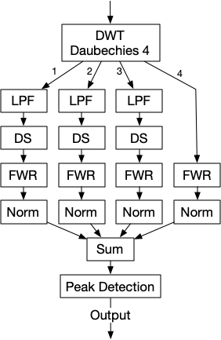

# beattrack - Track the rhythm of music in a wav file.

## Status

This version - v1 - works on a different principle than v0. See **How it works** below.
The output is incompatible with v0.

`Beattrack` is still in an early stage of development and will
not work on all audio files. The following types of input are problematic:

1. Music without a strong rhythm.
1. Tracks where the music is weaker than other audio noise.
   For example: video taken on a cell phone in a noisy environment.

`Beattrack` has been tested successfully on Salsa and Kizomba.

## Overview

`beattrack` is a command-line application that tracks the rhythm of music. The primary application is to play video frame-by-frame to the rhythm of the sound track.

`beattrack` is ignorant of musical structure. It simply detects and tracks the rhythm of sound energy produced by the music. In the rest of this description _beat_ will refer to the rhythm detected by `beattrack`.

`beattrack` has only one adjustable parameter: the minimum time between two rhythmic peaks.
By turning this knob the user can find the best extracted rhythm for a particular
piece of music, as illustrated by the figures below.

Both graphs in the figure below show the energy envelope of the same 3 seconds of a salsa. The blue graph represents the sound
energy against time. The rhythmic pattern of the music is clearly visible. Samples 4723..6139 show
3 more or less equally spaced notes of approximately the same duration. The black lines
show the peaks reported by `beattrack`. The graph on the left shows the peaks detected for
`sep=250`, while the graph on the right shows the peaks for `sep=50`. The shorter the minimum
separation, the more peaks will be reported.


The figure below shows the peaks reported for 10 seconds of a kizomba with `sep = 250`.


## Running `beattrack`

Run `beattr -sep ms wavfile` to process `wavfile` with a minimum separation
between peaks of `ms` milliseconds.

Run `beattrack -h` for more extensive help.

### Input

The input is a wav file.

### Output

`beattrack` produces a JSON file containing the following data structure:

```
type OutRecord struct {
	FileName       string // Input file
	SampleRate     int    // Fs in Hz
	NumChannels    int    // Number of channels in wav file
	PeakSeparation int    // Minimum distance between peaks in milliseconds
	Peaks          []Peak // List of detected peaks
}

type Peak struct {
	Offset   int // Number of samples from start of channel at Fs
	MsOffset int // Number of milliseconds from start of channel
}

```

The extract below shows a sample output:

```
{
    "FileName": "salsa2.wav",
    "SampleRate": 44100,
    "NumChannels": 2,
    "PeakSeparation": 250,
    "Peaks": [
        {
            "Offset": 12752,
            "MsOffset": 289
        },
```

The first peak is 289 ms or 12752 samples from the start of the channel.

```
        {
            "Offset": 28432,
            "MsOffset": 644
        },
        {
            "Offset": 56768,
            "MsOffset": 1287
        },
        .
        .
        .
        {
            "Offset": 1312864,
            "MsOffset": 29772
        }
    ]
}
```

## Installation

1. `beattrack` requires Go v1.13. To install Go: [https://golang.org/doc/install](https://golang.org/doc/install).
2. Install `beattrack`: `go get github.com/goccmack/beattrack`

## How it works

`beattrack` is based on the approach described in the [following paper](https://soundlab.cs.princeton.edu/publications/2001_amta_aadwt.pdf):

    Audio Analysis using the Discrete Wavelet Transform
    George Tzanetakis, Georg Essl, Perry Cook
    Proceedings of the WSES International Conference Acoustics and Music: Theory and Applications (AMTA 2001)

The paper by Tzanetakis et.al. describes a system to detect the average beat in music. `beattrack` extends this approach to track the position of the rhytm in the channel.

The rhythm detection depends on the sound energy of the rhythm at each point in the channel.

The following describes the algorithm at an overview level.



1. Channel 0 of the wave file is passed through 4 scales of DWT with a Daubechies-4 wavelet.
2. Scales 1-3 are low-pass filtered and down-sampled to the size of scale 4.
3. All scales are full-wave rectified as described in Tzanetakis et. al.
4. All scales are normalised as in Tzanetakis et. al.
5. The four scales are summed. This gives the energy envelope of the signal.

At this point we deviate from Tsanetakis by:

6. Finding the peaks of energy envelop with a configurable minimum separation
   between peaks.

## DSP functions

All the DSP functions, including the Daubechies-4 DWT and peak detection, are implemented in:
[https://github.com/goccmack/godsp](https://github.com/goccmack/godsp)

```

```
